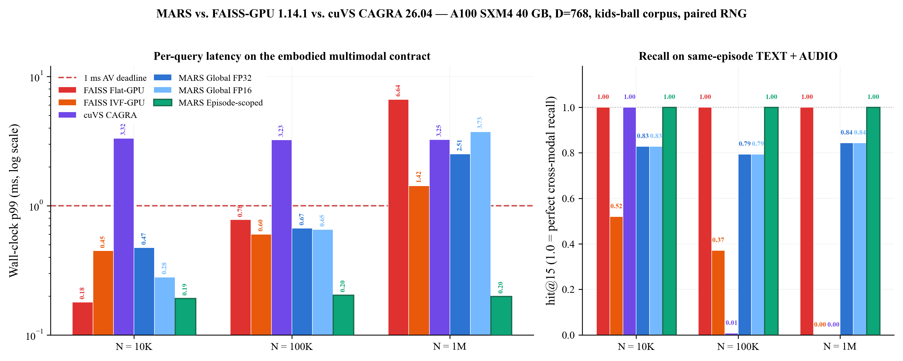
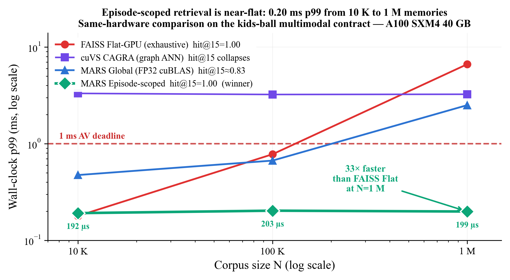
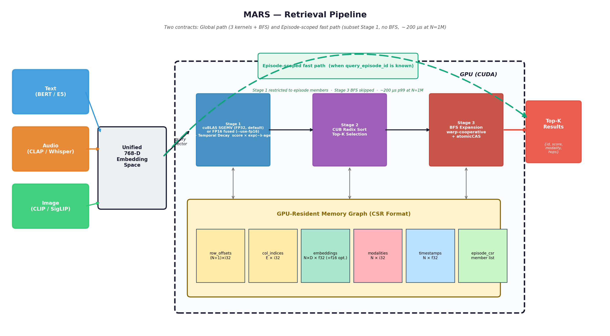

# MARS: Memory for Autonomous Real-Time Systems

A GPU-resident retrieval substrate with native temporal decay
for real-time embodied AI.

[](https://developer.nvidia.com/cuda-downloads)
[](https://isocpp.org/)
[](LICENSE)
[](tests/test_memory_graph.cpp)
[](https://www.fratepietro.com/papers/MARS/main.pdf)
[](https://doi.org/10.5281/zenodo.19493869)

---

## The problem

A child's ball rolls into the road from behind a parked van. Vision
sees only the ball. But 600 ms earlier, the vehicle's microphones
captured children's voices from that direction — a memory that raises
the prior that a child may follow. The useful memory is 600 ms old,
from a different modality, and low in cosine similarity compared to
irrelevant alternatives. No ranking by similarity alone can surface it.

Existing GPU vector search libraries (FAISS, cuVS) rank by cosine
similarity alone. A post-hoc temporal filter fixes temporal ranking,
but adds a second pipeline stage. MARS integrates temporal decay
natively into the GPU retrieval path — matching FAISS+filter precision
(0.910) at identical latency (0.26 vs 0.25 ms), without the filter.

| Gap | Without MARS | With MARS |
|-----|-------------|-----------|
| **Temporal awareness** | Post-hoc filter needed (two-stage) | Native in retrieval path |
| **Streaming insertion** | Rebuild every N seconds | Immediately queryable |
| **Cross-modal retrieval** | Application-level join | Graph bridges via BFS |

---

## Key results

Measured on **A100 SXM4 40GB** (D=768, K=10, cuBLAS+CUB):

| Corpus | p99 | Status | VRAM |
|--------|-----|--------|------|
| 1K | **0.31 ms** | PASS (1ms) | 3 MB |
| 10K | **0.44 ms** | PASS (1ms) | 30 MB |
| 50K | **0.56 ms** | PASS (1ms) | 150 MB |
| 100K | **0.74 ms** | PASS (5ms) | 300 MB |
| 1M | **2.67 ms** | PASS | 3.1 GB |
| 10M | **22.3 ms** | PASS | 30 GB |
| **13M** | **29.1 ms** | PASS | **40 GB (max)** |

All corpus sizes up to 50K pass the **1 ms AV perception deadline** with zero misses.
13M memories (maxing 40GB VRAM) at 29 ms.

**Out-of-core tiled retrieval** (embeddings in host RAM, streamed through GPU):

| Corpus | Tiles | Transfer | Compute | Total | Host RAM |
|--------|-------|----------|---------|-------|----------|
| 10M | 2 | 2,479 ms | 37.6 ms | 2,517 ms | 30.7 GB |
| 50M | 10 | 13,100 ms | 203 ms | 14,017 ms | 153.6 GB |

GPU compute is only 1.5% of total — the bottleneck is PCIe bandwidth at ~12.4 GB/s.
For real-time workloads, keep the working set in VRAM (up to 13M on A100 40GB).

**Head-to-head against modern GPU ANN libraries** — paired-probe A100 run
2026-04-17, kids-ball corpus, query is an IMAGE node and we measure
`hit@15` of the same-episode TEXT *and* AUDIO neighbors (the embodied
multimodal contract). See [`results/competitors_20260417/SUMMARY.md`](results/competitors_20260417/SUMMARY.md):

| System | N=10K p99 / hit@15 | N=100K p99 / hit@15 | N=1M p99 / hit@15 |
|--------|-------------------:|--------------------:|------------------:|
| FAISS Flat-GPU (exhaustive) | 0.18 ms / **1.00** | 0.78 ms / **1.00** | 6.64 ms / **1.00** |
| FAISS IVF-GPU (nprobe=64)   | 0.45 ms / 0.52     | 0.60 ms / 0.37      | 1.42 ms / **0.00** |
| cuVS CAGRA (graph_degree=64) | 3.32 ms / **1.00** | 3.23 ms / 0.01     | 3.25 ms / **0.00** |
| MARS Global (FP32 cuBLAS)   | 0.47 ms / 0.83     | 0.67 ms / 0.79      | **2.51 ms / 0.84** |
| MARS Global (FP16 fused)    | **0.28 ms** / 0.83 | 0.66 ms / 0.79      | 3.73 ms / 0.84    |
| **MARS Episode-scoped**     | **0.19 ms / 1.00** | **0.20 ms / 1.00**  | **0.20 ms / 1.00** |



*Wall-clock p99 (left, log scale) and `hit@15` (right, linear) for six
systems at N ∈ {10K, 100K, 1M}. MARS Episode-scoped (rightmost green
bar in each group) is the only system simultaneously below the 1 ms
AV deadline AND at perfect cross-modal recall everywhere. Generated
by `scripts/generate_competitor_figures.py` directly from the JSON
artefacts in `results/competitors_20260417/`.*

Two findings drove the design (read [`SUMMARY.md`](results/competitors_20260417/SUMMARY.md) for the full trace):

- **MARS Episode-scoped is Pareto-dominant** at every N: 34× faster than FAISS Flat at 1M, and 16× faster than CAGRA — both at perfect recall.
- **Cosine ANN baselines collapse on this metric at scale**: the kids-ball corpus has tiny clusters (10 nodes per episode, 100 K episodes at 1M), so per-episode TEXT/AUDIO are buried among ~999 990 distractors. CAGRA's graph traversal (even at search_k=512) and IVF cells (any nprobe) miss them. MARS keeps episode membership in the graph topology and recovers them in O(member_count).

**Episode-scoped retrieval** (when `query_episode_id` is known —
embodied loops, AV per-track memory, voice-agent conversation): MARS
restricts Stage 1 to episode members and skips BFS, producing a
near-flat scaling curve at sub-200 µs across all corpus sizes (paired
A100 probes, see `results/iteration_steps/vast_a100_paired_20260417/`):

| N | Global p99 | **Episode-scoped p99** | Speedup | Episode hit@15 |
|---|-----------:|-----------------------:|:-------:|---------------:|
| 10K  | 0.349 ms | **0.165 ms** | 2.1× | 0.83 → **1.00** |
| 50K  | 0.462 ms | **0.172 ms** | 2.7× | 0.88 → **1.00** |
| 100K | 0.551 ms | **0.174 ms** | 3.2× | 0.79 → **1.00** |
| 1M   | 2.561 ms | **0.197 ms** | **13×** | 0.84 → **1.00** |



*Same A100 SXM4 40 GB hardware. Episode-scoped MARS (green diamond)
stays near-flat at ~200 µs across three decades of N while every
cosine-only baseline either rises with N (FAISS Flat → 6.6 ms at 1M)
or loses recall on this multimodal-episode metric (CAGRA hit@15 = 0
at N≥100K). Generated by `scripts/generate_competitor_figures.py`
directly from the JSON artefacts in `results/competitors_20260417/`.*

See [docs/BENCHMARKS.md](docs/BENCHMARKS.md) for full results across
GPUs, scaling sweeps to 13M memories, and the FAISS/CAGRA comparison.

---

## How it works



Text, audio, image, and sensor embeddings share a 768-D space as nodes
in a multimodal graph with explicit **cross-modal bridges**. Two
contracts share the same GPU-resident data:

**Global path** (when no episode handle is available): three stages,
sub-millisecond at N ≤ 50K, zero per-query allocation.

1. **Stage 1 — Cosine + temporal decay.** Default: cuBLAS Sgemv (FP32)
   followed by `score × exp(-λ·age)`. Opt-in `--use-fp16` switches to
   the hand-fused FP16 cosine kernel — wins by 41 % at N=10K but loses
   by 49 % at N=1M (see `fig_fp16_crossover` in the paper).
2. **Stage 2 — CUB radix sort top-K** in O(N).
3. **Stage 3 — Warp-cooperative BFS** — cross-modal graph expansion
   through NSN bridges with `atomicCAS` race-free neighbor claiming.

**Episode-scoped fast path** (when `query_episode_id` is supplied —
embodied loops, AV per-track memory, voice-agent conversation):
Stage 1 is restricted to the episode's CSR member list and Stage 3
BFS is skipped entirely. The result is a **near-flat** retrieval
curve at ~200 µs p99 from N=10K all the way to N=1M, with **perfect
cross-modal recall** on the kids-ball multimodal contract — the
green dashed arc in the diagram above.

---

## Quick start

```bash
git clone https://github.com/antonellof/MARS.git
cd MARS

make tests          # host-only unit tests (no GPU needed)
make                # full build
make check          # hardware validation → results/results.json
make demo-av        # 60 Hz AV perception demo
make bench-mars       # MARS benchmark sweep
make bench-ablation # NSN ablation study
```

### On vast.ai / cloud GPU

```bash
git clone https://github.com/antonellof/MARS.git
cd MARS
make info && make && make check
```

---

## Four application demonstrators

| Demo | Rate | Budget | Corpus | Command |
|------|------|--------|--------|---------|
| AV perception | 60 Hz | 1 ms | 2,400 | `make demo-av` |
| Humanoid robot | 1 kHz | 1 ms | 10,000 | `make demo-robot` |
| AR/VR spatial | 90 Hz | 5 ms | 27,000 | `make demo-ar` |
| Voice agent | 30 Hz | 20 ms | 9,000 | `make demo-voice` |

All pass wall-clock p99 budgets on A100 and RTX 5060 Ti. Temporal
decay constants: AV lambda=0.5 (2s window), robot lambda=0.1 (10s),
AR lambda=0.003 (5min), voice lambda=1e-4 (30min).

---

## FAISS comparison experiments

### Temporal relevance (AV perception, 9K memories)

| System | TP@10 | Stale Rate | p99 |
|--------|-------|------------|-----|
| FAISS GPU Flat (cosine only) | 0.218 | 0.493 | 0.13 ms |
| FAISS + post-hoc temporal filter | 0.910 | 0.000 | 0.25 ms |
| **MARS** (native temporal decay) | **0.910** | **0.000** | **0.26 ms** |
| Ring buffer + cuBLAS SGEMV | — | — | 0.12 ms |

MARS matches FAISS + post-hoc filter at identical latency (0.26 vs
0.25 ms) while eliminating the filter code. A raw ring buffer is 3.2x
faster (0.12 ms) but provides no temporal decay, cross-modal retrieval,
or streaming insertion.

### Streaming insertion (60 Hz, 10 dets/frame)

| System | Freshness Rate | Rebuild cost | Miss recent |
|--------|---------------|-------------|-------------|
| FAISS (rebuild/1s) | 6.8% | 9.0 ms/rebuild | 93.2% |
| **MARS** (online) | **100%** | **0 ms** | **0%** |

---

## Comparison to similar projects

| System | GPU-resident | Streaming inserts | Temporal decay | Importance | Cross-modal | Sub-ms p99 | Built for real-time loops |
|---|---|---|---|---|---|---|---|
| **FAISS GPU (Flat/IVF)** | ✅ | ❌ rebuild | ❌ | ❌ | ❌ | ✅ | ❌ |
| **cuVS CAGRA** | ✅ | ❌ batch-build | ❌ | ❌ | ❌ | ❌ (~2.5 ms) | ❌ |
| **Milvus / Pinecone / Qdrant** | partial | ✅ | ❌ | ❌ | partial | ❌ (DB call) | ❌ |
| **NVIDIA nvblox / cuVSLAM** | ✅ | ✅ | ❌ | ❌ | ❌ (geometry only) | ✅ | ✅ |
| **NVIDIA ReMEmbR** | ❌ | ✅ | ❌ | ❌ | partial (VLM) | ❌ | partial |
| **MARS** | ✅ | ✅ | ✅ native | ✅ | ✅ graph BFS | ✅ | ✅ |

The closest neighbors split into two camps:

**Camp 1 — fast but stateless.** FAISS, CAGRA. Built for static corpora, they optimize Recall@K against a frozen index. They have no concept of *when* a vector was inserted or *whether* it still matters. Not wrong; solving a different problem.

**Camp 2 — stateful but slow.** Milvus, ReMEmbR, Pinecone, Qdrant. They handle streaming and (sometimes) decay, but the retrieval path is a database call measured in tens of milliseconds. Fine for batch and chat. Fatal for sensor-rate loops.

**MARS sits in both camps at once:** GPU-resident like Camp 1, continuously updating like Camp 2. The August 2025 arXiv survey *Multimodal Data Storage and Retrieval for Embodied AI* names this gap as *"a fundamental tension between long-term semantic coherence and real-time responsiveness."* MARS is the first GPU-kernel-level answer to it.

---

## Future directions

### Shipped on `feature/landscape-2026-improvements` (2026-04-17)

| Feature | Branch | Status |
|---------|--------|--------|
| **Episode-scoped retrieval** — `RetrievalScope::EpisodeScoped` restricts Stage 1 to episode members, skips BFS, near-flat ~200 µs at N=1M | `feature/landscape-2026-improvements` | **Shipped, validated on A100** |
| **FP16 fused cosine** — hand-fused FP16 + temporal-decay kernel; opt-in via `--use-fp16` flag | `feature/landscape-2026-improvements` | **Shipped, validated** (wins at N≤10K, loses at N=1M — opt-in only) |
| **Head-to-head competitor benchmarks** — paired-RNG FAISS-GPU and cuVS CAGRA harness (`scripts/bench_kids_ball_{faiss,cuvs_cagra}.py`) | `feature/landscape-2026-improvements` | **Shipped, see [`SUMMARY.md`](results/competitors_20260417/SUMMARY.md)** |

### In progress (feature branches)

| Feature | Branch | Status |
|---------|--------|--------|
| **Binary persistence** — checkpoint/restore MemoryGraph to disk with FNV-1a checksums | `feature/persistence` | Scaffolded + tests |
| **Python bindings** — pybind11 wrapper for MemoryGraph, NSN builder, NumPy interop | `feature/python-bindings` | Scaffolded + tests |
| **Streaming insertion** — pre-allocated ring buffer with batch commit + incremental NSN edges | `feature/streaming-insertion` | Scaffolded + tests |
| **VRAM budget calculator** — deterministic worst-case memory footprint for safety-critical deployment | `feature/memory-budget` | Scaffolded + tests |
| **CUDA Graph capture** — record 4-kernel pipeline as CUDA Graph for replay, eliminates launch overhead | `feature/cuda-graph-capture` | Scaffolded — **known bug** at `memory_cuda.cu:1197` (counters not reset between replays); see `docs/ARCHITECTURE.md` §7.4 |
| **FP16 tensor-core (WMMA)** — `nvcuda::wmma` kernel using tensor cores on V100+ — distinct from the shipped hand-fused FP16 above | `feature/fp16-tensor-core` | Scaffolded |

### Planned

- **cuBLAS epilogue fusion** — fuse temporal decay into the SGEMV epilogue via cuBLASLt to eliminate the separate decay kernel
- **Multi-stream concurrent retrieval** — CUDA streams with priority hints for parallel fast-control + slow-planning queries
- **Multi-GPU sharding** — NVLink-based partitioning for corpora exceeding single-GPU HBM
- **Cross-modal hero demo** — audio event in, visual + sensor context out in one query, sub-3 ms
- **Integration adapters** — MARS as L1 cache beneath Milvus, nvblox, LangGraph
- **Learned importance** — online-updated importance head conditioned on downstream task outcomes

### Validation plan (vast.ai A100)

Each feature branch will be validated on vast.ai A100 SXM4 80 GB:

```bash
# 1. Persistence: save/load round-trip + latency overhead
make tests                          # host-only persistence tests
make bench-av                       # baseline
# save → load → bench-av            # verify no regression after reload

# 2. Streaming insertion: flush latency + query correctness during insert
make bench-av                       # baseline with static corpus
# streaming insert 1K nodes → re-bench → compare p99

# 3. VRAM budget: predicted vs actual
make check                          # compare budget prediction to cudaMemGetInfo

# 4. CUDA Graph: A/B comparison
make bench-graph                    # no-graph vs graph at N=10K, 50K

# 5. FP16 WMMA: tensor-core vs scalar FP16
make bench-wmma                     # FP32 vs FP16-scalar vs FP16-WMMA at N=10K, 50K

# 6. Full regression
make bench-av && make bench-robot && make bench-ar && make bench-voice
make bench-sustained && make bench-scale
```

---

## Repository layout

```
include/
  memory_graph.h       Host-side CSR graph + NSN builder
  memory_cuda.cuh      CUDA kernel API + importance + novelty gate
  persistence.h        Binary checkpoint/restore with FNV-1a checksums
  streaming.h          Pre-allocated ring buffer for online insertion
  memory_budget.h      Deterministic VRAM budget calculator
  tiled_query.h        Out-of-core tiled retrieval for 50M+ corpus
  cuda_graph_capture.h CUDA Graph capture/replay management
  wmma_similarity.cuh  Tensor-core similarity kernel

src/
  memory_cuda.cu       CUDA kernels (similarity, temporal decay, top-K, BFS,
                       novelty gate, adaptive graph, importance)
  memory_graph.cpp     NSN construction (5 phases, configurable)
  persistence.cpp      Binary serialization with integrity verification
  streaming.cpp        Streaming insertion + incremental NSN edges
  memory_budget.cpp    VRAM budget computation
  tiled_query.cu       Out-of-core retrieval (host RAM -> GPU tiles)
  latency_bench.cu     Deadline-aware benchmark with --ablate and --recall
  validate.cu          JSON validation harness

python/                pybind11 bindings for MemoryGraph
demos/                 4 real-world demonstrators + AV visual demo
tests/                 Host-only unit tests (17 passing)
results/               Raw JSON from experiments
paper/                 MARS paper (LaTeX + PDF)
scripts/               FAISS comparison, figure generation, ablation parser
docs/                  Architecture, benchmarks, validation guides
```

---

## Documentation

- **[BENCHMARKS.md](docs/BENCHMARKS.md)** — full performance data, FAISS/CAGRA
  comparison, scaling sweeps, optimization history
- **[ARCHITECTURE.md](docs/ARCHITECTURE.md)** — kernel design, graph theory,
  data layout
- **[HARDWARE_VALIDATION.md](docs/HARDWARE_VALIDATION.md)** — step-by-step
  guide for running on vast.ai

---

## Citation

```bibtex
@misc{fratepietro2026mars,
  title     = {{MARS}: A {GPU}-Resident Retrieval Substrate with
               Native Temporal Decay for Real-Time Embodied {AI}},
  author    = {Fratepietro, Antonello},
  year      = {2026},
  publisher = {Zenodo},
  doi       = {10.5281/zenodo.19493869},
  url       = {https://doi.org/10.5281/zenodo.19493869}
}
```

## License

MIT — see [LICENSE](LICENSE).

## Author

**Antonello Fratepietro**
