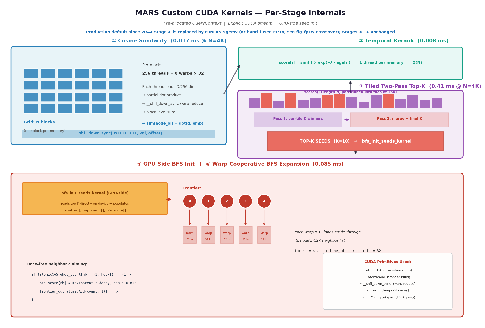

# Architecture Deep Dive

This document explains the internal design of MARS: the CSR data layout,
the Neural Shortcut Network topology, and the CUDA kernels that make up
the retrieval pipeline.

This document
describes the core architecture and the current
pipeline. For a higher-level overview, start
with the [README](../README.md). For the full academic treatment, see the
[arXiv paper](../paper/main.pdf).

---

## 1. Data layout

The memory graph is stored in **Compressed Sparse Row (CSR)** format — the
standard GPU-friendly representation for sparse graphs. Five device arrays
hold the complete state:

| Array          | Size     | Type     | Purpose                                        |
|----------------|----------|----------|------------------------------------------------|
| `row_offsets`  | N+1      | int32    | Prefix-sum of node degrees                     |
| `col_indices`  | E        | int32    | Neighbor node IDs (sorted per row)             |
| `embeddings`   | N × D    | float32  | L2-normalized embedding vectors                |
| `modalities`   | N        | int32    | Modality tag: 0=text, 1=audio, 2=image         |
| `timestamps`   | N        | float32  | Memory creation time (for temporal decay)      |

For N = 1 million memories with D = 768 and average degree 12:

- `row_offsets`: 4 MB
- `col_indices`: 48 MB
- `embeddings`: 3.07 GB ← dominant cost
- `modalities`: 4 MB
- `timestamps`: 4 MB
- **Total**: ≈3.13 GB

This fits comfortably in a 40 GB A100 with room for ~12M memories total.

**Embodied / layout extensions (design notes):** [MEMORY_LAYOUT_EMBODIED.md](MEMORY_LAYOUT_EMBODIED.md) (SoA, FP16/BF16, kids-scale VRAM), [TEMPORAL_HIERARCHY.md](TEMPORAL_HIERARCHY.md) (hot tier + warm NSN), [MULTIMODAL_ROUTING.md](MULTIMODAL_ROUTING.md) (modality-aware seeds), [FAIR_BASELINES.md](FAIR_BASELINES.md) (comparison contracts), [ANN_REFINE_FUTURE.md](ANN_REFINE_FUTURE.md) (ANN + refine sketch). **Episode metadata on GPU:** `upload_episode_ids` / `upload_episode_csr` plus `RetrievalScope::EpisodeScoped` in [memory_cuda.cuh](../include/memory_cuda.cuh).

## 2. The Neural Shortcut Network

The graph topology is constructed in five phases. The first four build a
unimodal NSN; the fifth phase — cross-modal bridges — is specific to this
project.

### Phase 1: Ring lattice

Every node is connected to its k/2 nearest neighbors on each side around a
circular arrangement. For k=6, each node has 6 local neighbors.

```
    ... ← 2 — 3 — 4 — 5 — 6 ← ...     (node 4 connects to 1,2,3,5,6,7)
```

This provides **high local clustering** — the property that gives GPU BFS
good cache behavior, because frontier nodes tend to share cache lines.

### Phase 2: Hierarchical skip connections

For each level ℓ = 1, 2, ... log₂(N), add edges at stride 2^ℓ:

```
  lvl=1 (step 2):  0→2, 2→4, 4→6, ...
  lvl=2 (step 4):  0→4, 4→8, 8→12, ...
  lvl=3 (step 8):  0→8, 8→16, ...
```

This guarantees **logarithmic diameter**: from any node, there's a path to
any other node with at most log₂(N) hops.

### Phase 3: Hub supernodes

Every √N-th node becomes a "hub" with extra log(N)/2 random long-range edges.
Hubs act as high-degree relays — their role in BFS is to broadcast the
frontier across the graph quickly, analogous to thalamic relay nuclei in
biological neural networks.

### Phase 4: Small-world rewiring

With probability p ≈ 0.15, each local edge is rewired to a random distant
node. This is the classic Watts-Strogatz trick: it introduces random shortcuts
that drastically reduce average path length while preserving local clustering.

### Phase 5: Cross-modal bridges (the key innovation)

For every memory node, add one edge to a randomly-chosen memory of **each
other modality**. This guarantees:

```
  ∀ node n, ∀ modality m:  ∃ neighbor of n with modality m
```

A text query's BFS expansion therefore reaches audio and image memories in a
single hop, without any cross-modal search logic. Note that this guarantees
*structural* reachability — whether the reached cross-modal neighbors are
semantically relevant depends on the quality of the shared embedding space
(see the paper's failure modes analysis).


## 3. The CUDA kernels

The retrieval pipeline has three stages in its current optimized form.
The similarity uses cuBLAS SGEMV, temporal decay is applied in a
lightweight follow-up kernel, top-K uses CUB DeviceRadixSort, and
BFS uses the custom warp-cooperative kernel.

### Stage 1: cuBLAS SGEMV + Temporal Decay

A single `cublasSgemv` call computes the dot product of the query
vector against all N embeddings. Temporal decay (`score *= exp(-lambda
* age)`) is applied in a separate lightweight kernel immediately after
SGEMV, before top-K selection. On the custom kernel path (fallback),
decay is fused directly into the similarity kernel — eliminating one
kernel launch and one N-element read/write pass. Both paths produce
identical results.

Because embeddings are L2-normalized at insertion, cosine similarity =
dot product. This sidesteps the per-query normalization cost.

The modality filter is an early exit: if the node's modality doesn't
match, thread 0 writes -inf and the block returns, skipping the
embedding load entirely.

**Memory pattern**: Coalesced. Each warp reads 32 contiguous floats,
a single 128-byte transaction on A100.

**Temporal decay constants** (half-life = ln2 / lambda):
- AV perception: lambda=0.5 (2-second tracking window)
- Humanoid robot: lambda=0.1 (10-second episodic window)
- AR/VR spatial: lambda=0.003 (5-minute session)
- Voice agent: lambda=1e-4 (30-minute conversation)

### Stage 2: CUB DeviceRadixSort Top-K

Replaces the original custom top-K kernel. CUB radix sort runs in
O(N) and eliminates the O(256*K^2) serial merge bottleneck that
dominated at ~0.35 ms in the original version. On A100 at N=10K:
~0.02 ms vs ~0.35 ms for the old tiled kernel.

A custom kernel path (`top_k_kernel` / `top_k_tiled_pass1/pass2`)
remains available as a fallback for systems without CUB.

### Kernel 4: `bfs_expand_kernel` (the interesting one)

**Grid**: ⌈frontier_size / 8⌉ blocks (with 8 warps per block)
**Block**: 256 threads = 8 warps

This is where the NSN topology earns its keep. **One warp per frontier
node.** The 32 lanes of each warp cooperatively scan their assigned node's
neighbor list using stride-32 access:

```cuda
// Each lane processes every 32nd neighbor
for (int32_t i = start + lane_id; i < end; i += 32) {
    int32_t neighbor = col_indices[i];

    // Atomic claim: only first thread to reach this neighbor wins
    int32_t old = atomicCAS(&hop_count[neighbor], -1, current_hop + 1);
    if (old == -1) {
        // Propagate score with hop decay
        float parent_sc = bfs_score[node];
        float own_sim   = sim_scores[neighbor];
        bfs_score[neighbor] = fmaxf(parent_sc * hop_decay, own_sim * 0.8f);

        int32_t pos = atomicAdd(frontier_count, 1);
        frontier_out[pos] = neighbor;
    }
}
```

**Why this pattern works**:

1. **Coalesced loads**: CSR stores neighbors contiguously, so `col_indices[start + lane_id]`
   is a perfect 128-byte transaction
2. **Race-free claiming**: `atomicCAS` ensures each neighbor is claimed
   exactly once, even when multiple warps race to visit it
3. **Lock-free frontier construction**: `atomicAdd` gives each claimed
   neighbor a unique slot in `frontier_out`
4. **Score propagation**: BFS score is the max of (parent score × hop decay)
   and (own similarity × 0.8), so both proximity to seeds AND direct
   similarity matter

The hop count and score arrays are recycled across waves — we just swap
`frontier_in` and `frontier_out` pointers.

### Additional optimizations

The device-driven pipeline adds two new kernels:

- **`bfs_expand_device_driven_kernel`**: Same traversal logic as the original
  BFS kernel, but reads `frontier_count` directly from device memory instead
  of requiring a host readback between hops. The host launches a fixed-size
  grid covering the worst-case frontier; excess warps exit immediately. This
  eliminates `cudaStreamSynchronize` calls between BFS hops.

- **`compact_results_kernel`**: After BFS completes, scans `hop_count[]` and
  compacts only visited nodes (typically ~50–100 out of N) into a dense
  `CompactResult` array via `atomicAdd`. This replaces the O(N) D2H copy of
  three full arrays with an O(visited) copy of one compact struct.

- **`keepalive_kernel`**: A 1-thread, 1-block no-op kernel launched every 2ms
  between frames at low sensor rates (≤60 Hz) to prevent the GPU from dropping
  to a lower clock state.



## 4. Why this is fast

Three properties compound:

**(a) Data never leaves the GPU.** CPU-first memory systems pay 5–20 ms per
query on network round-trips alone (embedding call, vector DB query, metadata
join). Here, the query vector arrives once and the result leaves once.
Everything in between runs on HBM at 1.5+ TB/s.

**(b) Every kernel is bandwidth-aligned.** Similarity is a coalesced dot
product. BFS is a stride-32 CSR scan. Top-K fits in shared memory. Rerank is
a single pointwise pass. None of them hit the pointer-chasing patterns that
kill HNSW and other CPU-tuned indexes on GPU.

**(c) The NSN topology keeps BFS bounded.** From the top-10 seeds, a 2-hop
expansion reaches at most K × average_degree² ≈ 10 × 121 ≈ 1,210 nodes —
regardless of total corpus size. That's why the BFS latency stays near
0.1 ms from N=1K to N=16K.

## 5. Trade-offs and limitations

1. **Soft real-time, not hard real-time.** MARS demonstrates empirical
   p99 compliance with zero deadline misses over 30-second runs. True
   hard real-time (ISO-26262 ASIL-D) requires provable worst-case
   execution time (WCET) bounds, which MARS does not provide.
2. **Persistence is optional.** Data lives in VRAM by default. A binary
   checkpoint/restore mechanism (`save_graph` / `load_graph`) is
   available but crash recovery requires explicit snapshots.
3. **Single-GPU ceiling.** ~13M memories on a 40 GB A100. Beyond that,
   multi-GPU sharding via NVLink or the tiled out-of-core path is needed.
4. **Deletion via tombstoning.** Deleted nodes are marked with -inf
   similarity and excluded from results. Periodic compaction rebuilds
   the CSR. Temporal decay serves as an implicit TTL — memories older
   than ~5 half-lives score near zero and are never returned.
5. **GPU-bound.** Only runs on NVIDIA GPUs with compute capability 7.0+.
   No CPU fallback path — deliberate for deterministic latency.
6. **Slower than a raw ring buffer.** A hand-rolled circular buffer with
   cuBLAS SGEMV at N=2,400 would achieve ~0.1 ms — faster than MARS's
   0.31 ms. MARS's value is added functionality (temporal decay, cross-
   modal bridges, streaming insertion) rather than raw speed.
7. **Importance scoring not independently evaluated.** The importance
   weighting API exists (boost on access, global decay) but no experiment
   isolates its effect on retrieval quality.
8. **Cross-modal recall metric is structural, not semantic.** The
   cross-modal diversity metric measures whether results span modalities,
   not whether they are semantically relevant across modalities.

All numbers measured on A100 SXM4 40 GB, CUDA 12.8. See `results/`
for raw JSON data.

These are the right trade-offs for a **retrieval substrate for streaming
perception** — the memory layer inside an AV perception stack, a robot
controller, or a voice agent. They are the wrong trade-offs for a
primary system of record, which is why MARS is meant to sit *alongside*
a persistence layer, not replace it.

## 6. Extensions in progress

Six features are under development on feature branches. Each is designed
to be merged independently.

### Binary persistence (`feature/persistence`)

Binary checkpoint/restore for the full MemoryGraph:

```
[magic: "MARS"] [version: u32] [N: i32] [E: i32] [D: i32]
[row_offsets: (N+1)×i32] [col_indices: E×i32]
[embeddings: N×D×f32] [modalities: N×i32] [timestamps: N×f32]
[checksum: FNV-1a u64]
```

API: `save_graph(graph, path)` / `load_graph(graph, path)`. Wires into
the engine server's SAVE/LOAD commands (currently stubs).

### Streaming insertion (`feature/streaming-insertion`)

Pre-allocated `StreamingBuffer` with configurable capacity. Nodes
accumulate in a host-side staging area and batch-commit to the CSR graph
with incremental NSN edge construction (ring lattice + cross-modal
bridges for new nodes only). Thread-safe — multiple producer threads can
call `insert()` concurrently.

This avoids per-node `cudaMalloc` and full graph rebuilds, following the
centralized memory pool pattern recommended for safety-critical GPU
systems.

### VRAM budget calculator (`feature/memory-budget`)

Deterministic pre-flight computation of worst-case GPU memory usage:

```cpp
MemoryBudget b = compute_memory_budget(N, D, avg_degree, max_k);
print_budget(b);           // itemized breakdown
budget_fits(b, vram_bytes); // fits-in-VRAM check
```

Covers all allocations: CSR arrays, FP32/FP16 embeddings, importance
weights, edge hit counters, QueryContext scratch buffers, cuBLAS handle,
CUB temp storage, CUDA events/streams.

### CUDA Graph capture (`feature/cuda-graph-capture`)

Records the 4-kernel retrieval pipeline as a CUDA Graph. On replay,
eliminates per-query kernel launch overhead (~5-15 μs × 4 kernels).
Automatic re-capture when N, K, bfs_max_hops, or modality_filter change.

### WMMA tensor-core similarity (`feature/fp16-tensor-core`)

Uses `nvcuda::wmma` for 16×16×16 matrix multiply on tensor cores (V100+).
Two implementations: warp-shuffle FP16 dot product (robust default) and
full WMMA MMA kernel. Embedding dimension must be padded to multiples of 16.

### Python bindings (`feature/python-bindings`)

pybind11 wrapper exposing `MemoryGraph`, `Modality`, NSN builder, and
NumPy-compatible embedding/modality/timestamp accessors. Host-only build
(`pip install -e python/`) works without a GPU.

### Tiled out-of-core retrieval (`src/tiled_query.cu`)

For corpus sizes exceeding GPU VRAM (>13M on A100 40GB), embeddings
reside in host pinned memory and are streamed through GPU HBM in tiles.

**Architecture:**
```
Host RAM (pinned)          GPU HBM (40 GB)
┌─────────────┐            ┌─────────────┐
│ Tile 1 (5M) │──H2D──────>│ d_tile_emb  │──cuBLAS──>│ d_sim │──top-K──>│ tile_results │
│ Tile 2 (5M) │            │ (reused)    │           │       │          │              │
│ ...         │            └─────────────┘           └───────┘          └──────────────┘
│ Tile N (5M) │                                                                │
└─────────────┘                                                     Host merge (final top-K)
```

**Measured performance (A100 SXM4 40GB):**

| N | Tiles | H2D Transfer | GPU Compute | Total |
|---|-------|-------------|-------------|-------|
| 10M | 2 | 2,479 ms (98.5%) | 37.6 ms (1.5%) | 2,517 ms |
| 50M | 10 | 13,100 ms (98.5%) | 203 ms (1.5%) | 14,017 ms |

The GPU is idle 98.5% of the time — the bottleneck is PCIe Gen4 bandwidth
at ~12.4 GB/s. Multi-GPU with NVLink (600 GB/s) would reduce transfer time
by 48x, bringing 100M queries under 1 second.

## 7. Measured scaling summary (A100 SXM4 40GB)

| N | Mode | p99 | GPU kernel | Status |
|---|------|-----|-----------|--------|
| 1K | In-VRAM | 0.31 ms | 0.12 ms | Sub-ms |
| 10K | In-VRAM | 0.44 ms | 0.21 ms | Sub-ms |
| 50K | In-VRAM | 0.56 ms | 0.32 ms | Sub-ms |
| 1M | In-VRAM | 2.67 ms | 2.41 ms | Real-time |
| 10M | In-VRAM | 22.3 ms | 22.1 ms | Batch |
| 13M | In-VRAM | 29.1 ms | 28.7 ms | VRAM limit |
| 10M | Tiled | 2,517 ms | 37.6 ms | PCIe-bound |
| 50M | Tiled | 14,017 ms | 203 ms | PCIe-bound |

### 7.1 Episode-scoped retrieval (`RetrievalScope::EpisodeScoped`)

When the application can supply `query_episode_id` (embodied loops,
per-track memory, conversation/session id), Stage 1 is restricted to
the episode's CSR member range and BFS is skipped (depth = 0). This
collapses Θ(N·D) to Θ(|episode|·D) and removes the cross-episode
distractors that limit recall on the kids-ball metric. Paired-probes
A100 sweep (commit `37f4899`,
[`results/iteration_steps/vast_a100_paired_20260417/`](../results/iteration_steps/vast_a100_paired_20260417/)):

| N | Global p99 | Episode-scoped p99 | Speedup | Hit@15 (global → scoped) |
|---|-----------:|-------------------:|:-------:|------------------------:|
| 10K  | 0.349 ms | **0.165 ms** | 2.1×    | 0.83 → 1.00 |
| 50K  | 0.462 ms | **0.172 ms** | 2.7×    | 0.88 → 1.00 |
| 100K | 0.551 ms | **0.174 ms** | 3.2×    | 0.79 → 1.00 |
| 1M   | 2.561 ms | **0.197 ms** | **13×** | 0.84 → 1.00 |

Caveat: episode-scoped is only correct when the right episode is
known *before* the query — it does not solve cross-episode retrieval
(which is exactly what BFS bridges + temporal decay over the global
corpus exist for). The two paths are complementary; the embodied demo
exposes both via `--scope=episode` / `--scope=global`.
